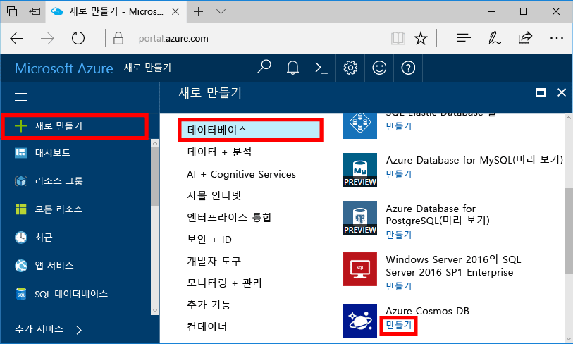
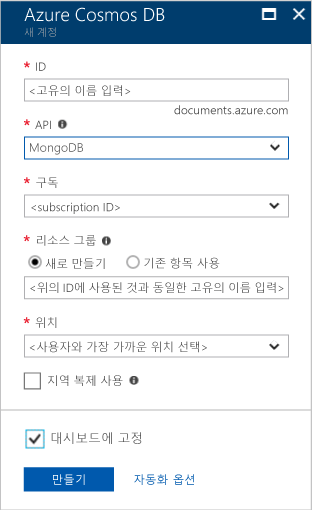
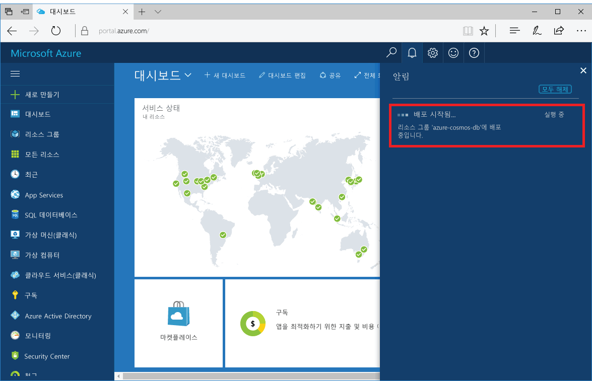
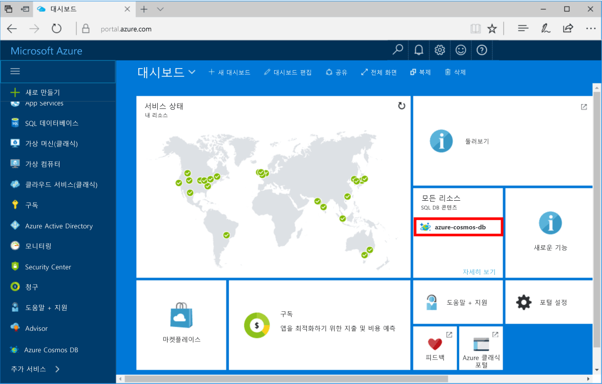

1. 새 창에서 toohello에 로그인 [Azure 포털](https://portal.azure.com/)합니다.
2. Hello 왼쪽된 메뉴에서를 클릭 **새로**, 클릭 **데이터베이스**, 그 다음 **Azure Cosmos DB**, 클릭 **만들기**합니다.
   
   

3. Hello에 **새 계정** 블레이드에서 hello Azure Cosmos DB 계정에 대 한 hello 원하는 구성을 지정 합니다. 

    Azure Cosmos DB를 사용하면 Gremlin(그래프), MongoDB, SQL(DocumentDB) 및 테이블(키-값)의 4가지 프로그래밍 모델 중 하나를 선택할 수 있습니다. 
       
    이 빠른 시작에서는 합니다 실제 프로그래밍 hello MongoDB API에 대해 선택할 수 있도록 **MongoDB** hello 양식을 작성할 때. 하지만 소셜 미디어 앱에 대한 그래프 데이터, 카탈로그 앱의 문서 데이터 또는 키/값(테이블) 데이터가 있는 경우, Azure Cosmos DB는 모든 중요 업무용 응용 프로그램에 대해 전 세계에 분산된 고가용성 데이터베이스 서비스 플랫폼을 제공할 수 있습니다.

    Hello 채울 **새 계정** 블레이드 hello 표의 hello 정보를 사용 하 여를 참조 합니다.
 
    
   
    설정|제안 값|설명
    ---|---|---
    ID|*고유 값*|고유한 이름을 tooidentify hello Azure Cosmos DB 계정이 있습니다. *documents.azure.com* 추가 toohello ID는 고유 하지만 식별이 가능한 ID를 사용 하므로, toocreate 프로그램 URI를 제공 소문자, 숫자 및 hello hello ID 포함 될 수 있습니다 '-' 문자, 있으며 3 ~ 50 자 사이 여야 합니다.
    API|MongoDB|우리는 hello에 대 한 프로그래밍 합니다 [MongoDB API](../articles/documentdb/documentdb-protocol-mongodb.md) 이 문서의 뒷부분에 나오는 합니다.|
    구독|*사용자의 구독*|안녕 hello Azure Cosmos DB 계정에 대 한 toouse 되도록 Azure 구독. 
    리소스 그룹|*hello 동일한 ID 값*|hello 새 리소스 그룹 이름을 사용자 계정에 대 한 합니다. 간단한 설명을 위해 hello 이름과 같은 이름을 사용자 id입니다.로 사용할 수 있습니다. 
    위치|*hello 지역 가장 가까운 tooyour 사용자*|지리적 위치에 있는 toohost Azure Cosmos DB 계정을 hello 합니다. Hello 위치를 가장 가까운 tooyour 사용자 선택 toogive toohello 데이터의 가장 빠른 액세스를 hello에 있습니다.

4. 클릭 **만들기** toocreate hello 계정.
5. Hello 도구 모음에서 **알림** toomonitor hello 배포 프로세스입니다.

    

6.  Hello 배포 완료 되 면 hello open hello 새 계정을 모든 리소스를 바둑판식으로 배열입니다. 

    
