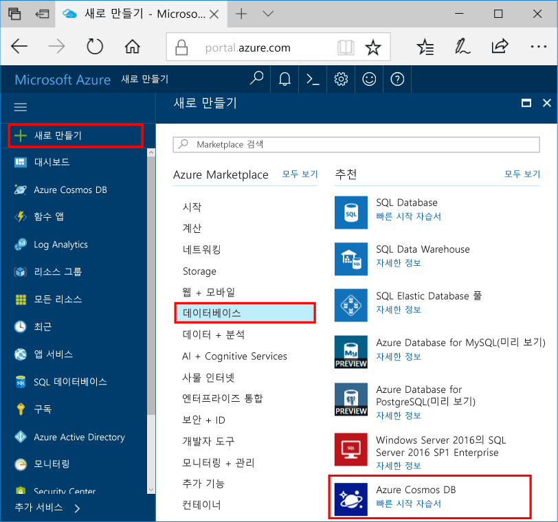

1. 새 창에서 [Azure Portal](https://portal.azure.com/)에 로그인합니다.In a new window, sign in to the [Azure portal](https://portal.azure.com/).
2. 왼쪽 메뉴에서 **새로 만들기**, **데이터베이스**를 차례로 클릭한 다음 **Azure Cosmos DB**에서 **만들기**를 클릭합니다.In the left menu, click **New**, click **Databases**, and then under **Azure Cosmos DB**, click **Create**.
   
   

3. **새 계정** 블레이드에서 Azure Cosmos DB 계정에 대해 원하는 구성을 지정합니다.In the **New account** blade, specify the desired configuration for the Azure Cosmos DB account. 

    Azure Cosmos DB를 사용하면 Gremlin(그래프), MongoDB, SQL(DocumentDB) 및 테이블(키-값)의 4가지 프로그래밍 모델 중 하나를 선택할 수 있습니다.With Azure Cosmos DB, you can choose one of four programming models: Gremlin (graph), MongoDB, SQL (DocumentDB), and Table (key-value). 
    
    이 빠른 시작에서는 Table API에 대한 프로그래밍을 수행하므로 양식을 작성할 때 **Table(키-값)**을 선택합니다.In this quick start we'll be programming against the Table API so you'll choose **Table (key-value)** as you fill out the form. 하지만 소셜 미디어 앱에 대한 그래프 데이터, 카탈로그 앱의 문서 데이터 또는 MongoDB 앱에서 마이그레이션한 데이터가 있는 경우, Azure Cosmos DB는 모든 중요 업무용 응용 프로그램에 대해 전 세계에 분산된 고가용성 데이터베이스 서비스 플랫폼을 제공할 수 있습니다.But if you have graph data for a social media app, document data from a catalog app, or data migrated from a MongoDB app, realize that Azure Cosmos DB can provide a highly available, globally-distributed database service platform for all your mission-critical applications.

    스크린샷의 정보를 가이드로 사용하여 새 계정 블레이드를 채웁니다.Fill out the New account blade using the information in the screenshot as a guide. 계정을 설정하면서 고유한 값을 선택하게 되므로 사용자의 값이 스크린샷과 정확하게 일치하지는 않습니다.You will choose unique values as you set up your account so your values will not match the screenshot exactly. 
 
    

    설정Setting|제안 값Suggested value|설명Description
    ---|---|---
    IDID|*고유 값**Unique value*|Azure Cosmos DB 계정을 식별하기 위해 선택하는 고유한 이름입니다.A unique name you choose to identify the Azure Cosmos DB account. *documents.azure.com*은 URI를 만들기 위해 제공하는 ID에 추가됩니다. 따라서 고유하지만 식별 가능한 ID를 사용합니다.*documents.azure.com* is appended to the ID you provide to create your URI, so use a unique but identifiable ID. ID는 소문자, 숫자 및 '-' 문자만 포함할 수 있으며, 3자에서 50자 사이여야 합니다.The ID may contain only lowercase letters, numbers, and the '-' character, and must be between 3 and 50 characters.
    APIAPI|Table(키-값)Table (key-value)|[Table API](../articles/cosmos-db/table-introduction.md)에 대한 프로그래밍은 이 문서의 뒷부분에 나옵니다.We'll be programming against the [Table API](../articles/cosmos-db/table-introduction.md) later in this article.|
    구독Subscription|*사용자의 구독**Your subscription*|Azure Cosmos DB 계정에 사용할 Azure 구독입니다.The Azure subscription that you want to use for the Azure Cosmos DB account. 
    리소스 그룹Resource Group|*ID와 동일한 값**The same value as ID*|계정의 새 리소스 그룹 이름입니다.The new resource group name for your account. 간단히 하기 위해 ID와 동일한 이름을 사용할 수 있습니다.For simplicity, you can use the same name as your ID. 
    위치Location|*사용자와 가장 가까운 지역**The region closest to your users*|Azure Cosmos DB 계정을 호스트할 지리적 위치입니다.The geographic location in which to host your Azure Cosmos DB account. 데이터에 빠르게 액세스할 수 있도록 사용자와 가장 가까운 위치를 선택합니다.Choose the location closest to your users to give them the fastest access to the data.   

4. **만들기** 를 클릭하여 계정을 만듭니다.Click **Create** to create the account.
5. 도구 모음에서 **알림**을 클릭하여 배포 프로세스를 모니터링합니다.On the toolbar, click **Notifications** to monitor the deployment process.

    

6.  배포가 완료되면 모든 리소스 타일에서 새 계정을 엽니다.When the deployment is complete, open the new account from the All Resources tile. 

    
