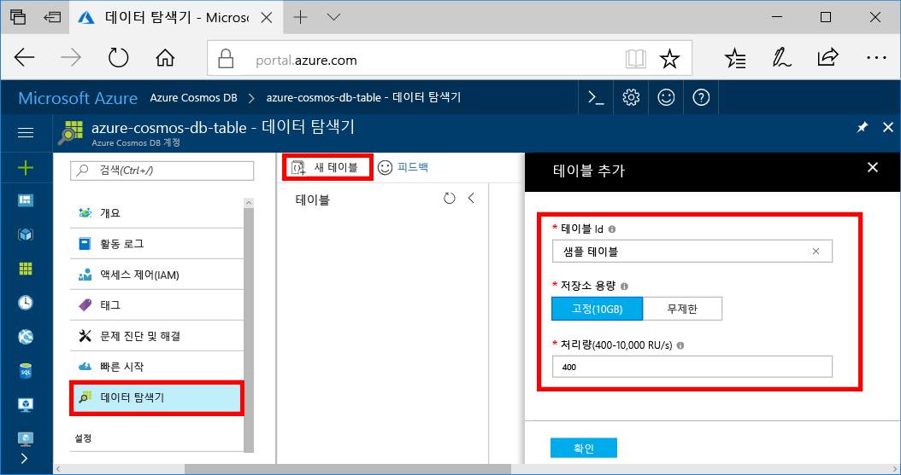

이제 데이터 탐색기 toocreate 테이블을 사용 하 여 추가 하는 데이터 tooyour 데이터베이스입니다.You can now use Data Explorer toocreate a table and add data tooyour database. 

1. Hello hello 탐색 메뉴에서 Azure 포털에서에서 클릭 **데이터 탐색기 (미리 보기)**합니다.In hello Azure portal, in hello navigation menu, click **Data Explorer (Preview)**. 
2. Hello 데이터 탐색기 블레이드의 클릭 **새 테이블**, 다음 정보는 hello를 사용 하 여 hello 페이지를 채웁니다.In hello Data Explorer blade, click **New Table**, then fill in hello page using hello following information.

    

    설정Setting|제안 값Suggested value|설명Description
    ---|---|---
    테이블 IDTable Id|sample-tablesample-table|새 테이블에 대 한 hello ID입니다.hello ID for your new table. 테이블 이름에는 hello 요구 사항 데이터베이스 id로 문자 동일 합니다.Table names have hello same character requirements as database ids. 데이터베이스 이름은 1~255자 사이여야 하며 `/ \ # ?` 또는 후행 공백을 포함할 수 없습니다.Database names must be between 1 and 255 characters, and cannot contain `/ \ # ?` or a trailing space.
    Storage 용량Storage capacity| 10 GB10 GB|Hello 기본값을 그대로 둡니다.Leave hello default value. 이 hello 데이터베이스의 저장 용량 hello입니다.This is hello storage capacity of hello database.
    처리량Throughput|400RU400 RUs|Hello 기본값을 그대로 둡니다.Leave hello default value. Hello 확장할 수 있습니다 [처리량](../articles/cosmos-db/request-units.md) tooreduce 대기 시간 하려는 경우 이후입니다.You can scale up hello [throughput](../articles/cosmos-db/request-units.md) later if you want tooreduce latency.

3. Hello 양식에 입력, 클릭 **확인**합니다.Once hello form is filled out, click **OK**.
