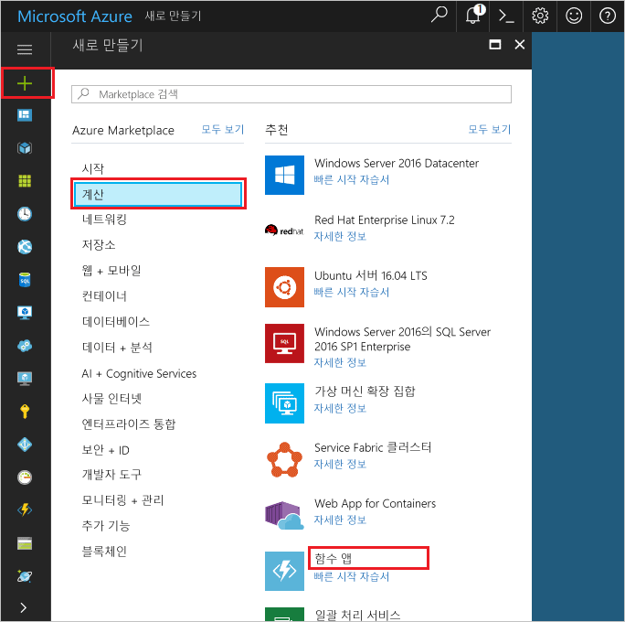

1. Hello 클릭 **새로** 단추 hello 왼쪽 위 모서리의 hello Azure 포털에서 찾을 수 있습니다.Click hello **New** button found on hello upper left-hand corner of hello Azure portal.

1. **계산** > **함수 앱**을 클릭하고 **구독**을 선택합니다.Click **Compute** > **Function App**, select your **Subscription**. Hello 테이블에 지정 된 hello 함수 응용 프로그램 설정을 사용 합니다.Then, use hello function app settings as specified in hello table.

    

    | 설정Setting      | 제안 값Suggested value  | 설명Description                                        |
    | ------------ |  ------- | -------------------------------------------------- |
    | **앱 이름****App name** | 전역적으로 고유한 이름Globally unique name | 새 함수 앱을 식별하는 이름입니다.Name that identifies your new function app. | 
    | **[리소스 그룹](../articles/azure-resource-manager/resource-group-overview.md)****[Resource Group](../articles/azure-resource-manager/resource-group-overview.md)** |  myResourceGroupmyResourceGroup | 앱을 이름 지정 hello 새 리소스 그룹의 어떤 toocreate 함수입니다.Name for hello new resource group in which toocreate your function app. | 
    | **[호스팅 계획](../articles/azure-functions/functions-scale.md)****[Hosting plan](../articles/azure-functions/functions-scale.md)** |   소비 계획Consumption plan | 리소스가 tooyour 함수 응용 프로그램에 할당 된 방식을 정의 하는 호스팅 계획 합니다.Hosting plan that defines how resources are allocated tooyour function app. Hello 기본에서 **소비 계획**, 리소스는 해당 함수가 필요에 따라 동적으로 추가 됩니다.In hello default **Consumption Plan**, resources are added dynamically as required by your functions. 함수를 실행 하는 hello 시간에 대 한만 지불 합니다.You only pay for hello time your functions run.   |
    | **위치**:**Location** | 서유럽West Europe | 사용자 근처 또는 함수가 액세스할 기타 서비스에 가까운 위치를 선택합니다.Choose a location near you or near other services your functions will access. |
    | **[저장소 계정](../articles/storage/common/storage-create-storage-account.md#create-a-storage-account)****[Storage account](../articles/storage/common/storage-create-storage-account.md#create-a-storage-account)** |  전역적으로 고유한 이름Globally unique name |  함수에서 사용 하는 앱에서 사용 하는 hello 새 저장소 계정의 이름입니다.Name of hello new storage account used by your function app. 저장소 계정 이름은 3자에서 24자 사이여야 하고 숫자 및 소문자만 포함할 수 있습니다.Storage account names must be between 3 and 24 characters in length and may contain numbers and lowercase letters only. 기존 계정을 사용할 수도 있습니다.You can also use an existing account. |

1. 클릭 **만들기** tooprovision hello 새 함수 앱 및 배포 합니다.Click **Create** tooprovision and deploy hello new function app.
