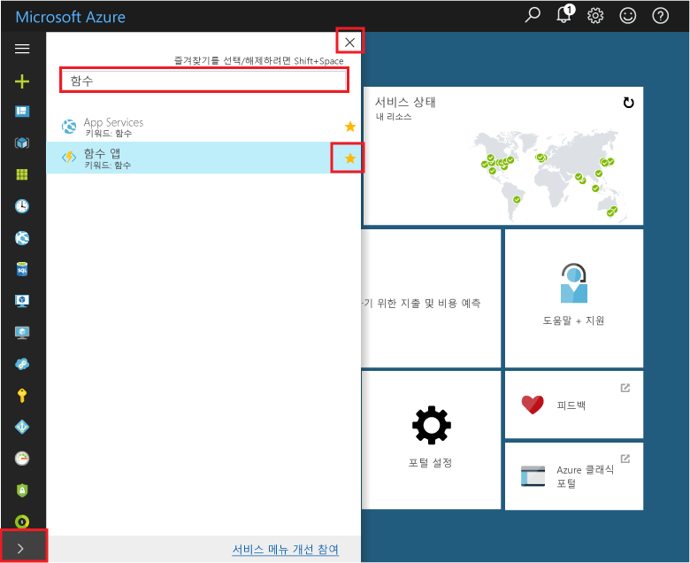
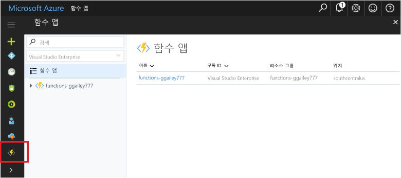

## 기능 앱 tooyour 포털 즐겨찾기를 추가 합니다.Add Function Apps tooyour portal favorites 

그렇게 이미 하지 않은 경우 hello Azure 포털에에서 기능 앱 tooyour 즐겨찾기를 추가 합니다.If you haven't already done so, add Function Apps tooyour favorites in hello Azure portal. 이렇게 하면 보다 쉽게 toofind 기능 앱.This makes it easier toofind your function apps. 이렇게 이미 있을 경우 toohello 다음 섹션을 건너뜁니다.If you have already done this, skip toohello next section. 

1. Toohello 로그인 [Azure 포털](https://portal.azure.com/)합니다.Log in toohello [Azure portal](https://portal.azure.com/).

2. 모든 서비스, 입력 hello 아래 왼쪽된 tooexpand hello 화살표를 클릭 합니다. `Functions` hello에 **필터** 필드, 고 클릭 hello 별 다음 너무**기능 앱**합니다.Click hello arrow at hello bottom left tooexpand all services, type `Functions` in hello **Filter** field, and then click hello star next too**Function Apps**.  
 
    

    그러면 hello 함수 아이콘 toohello 메뉴 hello 포털의 왼쪽 hello에 추가 됩니다.This adds hello Functions icon toohello menu on hello left of hello portal.

3. Hello 메뉴 닫기 다음 toohello 아래쪽 toosee hello 함수 아이콘 아래로 스크롤하십시오.Close hello menu, then scroll down toohello bottom toosee hello Functions icon. 이 아이콘 toosee 모든 함수 앱의 목록을 클릭 합니다.Click this icon toosee a list of all your function apps. 이 응용 프로그램에서 함수로 함수 앱 toowork 프로그램을 클릭 합니다.Click your function app toowork with functions in this app. 
 
    
 
     