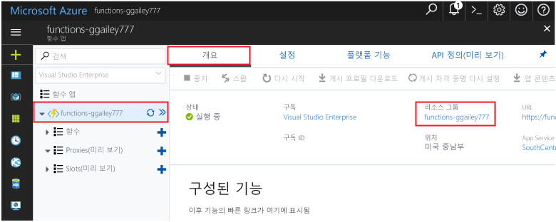

이 컬렉션의 다른 빠른 시작은 이 빠른 시작을 기반으로 합니다.Other quick starts in this collection build upon this quick start. 빠른 시작 이후 또는 hello 자습서 toowork toocontinue 하려는 경우이 빠른에서 만든 hello 리소스를 정리 실행할 수 없습니다.If you plan toocontinue on toowork with subsequent quick starts or with hello tutorials, do not clean up hello resources created in this quick start. 

Toocontinue 않으려는 경우 클릭 hello **리소스 그룹** hello 함수 앱 hello 포털과 클릭 한 다음에 대 한 **삭제**합니다.If you do not plan toocontinue, click hello **Resource group** for hello function app in hello portal, and then click **Delete**. 

