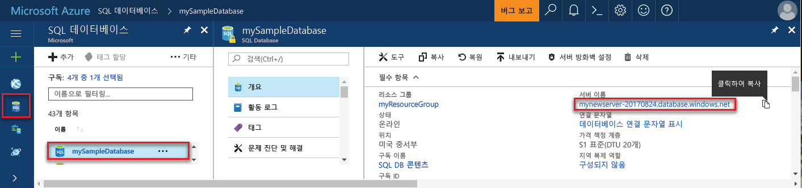

## Azure 포털 toohello에 로그인

Toohello 로그인 [Azure 포털](https://portal.azure.com/)합니다.

## Hello Azure 포털을 사용 하 여 빈 SQL 데이터베이스 만들기

Azure SQL Database는 일련의 정의된 [계산 및 저장소 리소스](../articles/sql-database/sql-database-service-tiers.md)를 사용하여 만들어집니다. hello 데이터베이스 내에서 만들어집니다는 [Azure 리소스 그룹](../articles/azure-resource-manager/resource-group-overview.md) 및는 [Azure SQL 데이터베이스 논리 서버](../articles/sql-database/sql-database-features.md)합니다. 

이러한 단계 toocreate 빈 SQL 데이터베이스를 따릅니다. 

1. Hello 클릭 **새로** 단추 hello 왼쪽 위 모서리의 hello Azure 포털에서 찾을 수 있습니다.

2. 선택 **데이터베이스** hello에서 **새로** 선택한 페이지 **SQL 데이터베이스** hello에서 **데이터베이스** 페이지. 

   

3. Hello 이미지 앞에 표시 된 대로 hello SQL 데이터베이스에 대 한 양식을 사용 hello 다음 정보를 입력 합니다.   

   | 설정 | 제안 값 | 설명 |
   | --------| --------------- | ----------- | 
   | **데이터베이스 이름** | mySampleDatabase | 유효한 데이터베이스 이름은 [데이터베이스 식별자](https://docs.microsoft.com/sql/relational-databases/databases/database-identifiers)를 참조하세요. | 
   | **구독** | 사용자의 구독  | 구독에 대한 자세한 내용은 [구독](https://account.windowsazure.com/Subscriptions)을 참조하세요. |
   | **리소스 그룹** | myResourceGroup | 유효한 리소스 그룹 이름은 [명명 규칙 및 제한 사항](https://docs.microsoft.com/azure/architecture/best-practices/naming-conventions)을 참조하세요. |
   | **원본 선택** | 빈 데이터베이스 | 빈 데이터베이스를 만들도록 지정합니다. |
   ||||

4. 클릭 **서버** toocreate 하 고 새 데이터베이스에 대 한 새 서버를 구성 합니다. Hello 채울 **새 폼 서버** hello 다음 정보로: 

   | 설정 | 제안 값 | 설명 |
   | --------| --------------- | ----------- | 
   | **서버 이름** | 전역적으로 고유한 이름 | 유효한 서버 이름은 [명명 규칙 및 제한 사항](https://docs.microsoft.com/azure/architecture/best-practices/naming-conventions)을 참조하세요. | 
   | **서버 관리자 로그인** | 모든 유효한 이름 | 유효한 로그인 이름은 [데이터베이스 식별자](https://docs.microsoft.com/sql/relational-databases/databases/database-identifiers)를 참조하세요.|
   | **암호** | 유효한 암호 | 암호가 8 자 이상 있어야 하며 hello 다음 범주 중 세 범주의 문자를 포함 해야 합니다: 대문자, 소문자, 숫자 및 영숫자가 아닌 문자. |
   | **위치**: | 모든 유효한 위치 | 지역에 대한 자세한 내용은 [Azure 지역](https://azure.microsoft.com/regions/)을 참조하세요. |
   ||||

   

5. **선택**을 클릭합니다.

6. 클릭 **가격 책정 계층** toospecify hello 서비스 계층과 성능 수준을 새 데이터베이스에 대 한 합니다. 이 자습서에서는 **20 DTU** 및 **250**GB의 저장소를 선택합니다.

   

7. **Apply**를 클릭합니다.  

8. 선택 된 **데이터 정렬** hello 빈 데이터베이스에 대 한 (이 자습서에서는 hello 기본값 사용). 데이터 정렬에 대한 자세한 내용은 [데이터 정렬](https://docs.microsoft.com/sql/t-sql/statements/collations)을 참조하세요.

9. 클릭 **만들기** tooprovision hello 데이터베이스입니다. 하나 있으며 toocomplete에 대 한 프로 비전 합니다. 

10. Hello 도구 모음에서 **알림** toomonitor hello 배포 프로세스입니다.

   

## Hello Azure 포털을 사용 하 여 서버 수준 방화벽 규칙 만들기

hello SQL 데이터베이스 서비스는 hello 서버 수준 방화벽을 만듭니다. 처음 hello 방화벽 외부 도구와 응용 프로그램이 toohello 서버나 tooany hello 서버에 있는 데이터베이스를 연결 하지 못하도록 방지 합니다. 방화벽 규칙 tooopen 특정 IP 주소를 만든 후 연결이 허용 됩니다. 이러한 단계 toocreate에 따라 한 [SQL 데이터베이스 서버 수준 방화벽 규칙](../articles/sql-database/sql-database-firewall-configure.md) 클라이언트의 IP 주소 및 사용자만 IP 주소에 대 한 hello SQL 데이터베이스 방화벽을 통해 tooenable 외부 연결에 대 한 합니다. 

> [!NOTE]
> Azure SQL Database는 포트 1433을 통해 통신합니다. 네트워크의 hello 방화벽 포트 1433 통해 아웃 바운드 트래픽을 허용 하는 후에 tooSQL 데이터베이스를 연결할 수 있습니다.

1. Hello 배포가 완료 된 후 클릭 **SQL 데이터베이스** hello 왼쪽 메뉴에서 **mySampleDatabase** hello에 **SQL 데이터베이스** 페이지. hello 완벽 하 게 hello 보여 주는 데이터베이스 열리면 프로그램에 대 한 개요 페이지에 정규화 된 서버 이름 (예: **mynewserver20170313.database.windows.net**) 하 고 더 이상의 구성에 대 한 옵션을 제공 합니다. 나중에 사용하기 위해 이 정규화된 서버 이름을 복사합니다.

   > [!IMPORTANT]
   > 이 정규화 된 서버 이름 tooconnect tooyour 서버와 데이터베이스의 후속 빠른 시작 해야합니다.
   > 

    

2. 클릭 **서버 방화벽 설정** hello 이전 그림에 나와 있는 것 처럼 hello 도구 모음입니다. hello **방화벽 설정** hello SQL 데이터베이스 서버에 대 한 페이지가 열립니다. 

    

3. 클릭 **클라이언트 IP 추가** hello 도구 모음 tooadd에 현재 IP 주소 tooa 새 방화벽 규칙입니다. 방화벽 규칙은 단일 IP 주소 또는 IP 주소의 범위에 1433 포트를 열 수 있습니다.

4. **Save**를 클릭합니다. 서버 수준 방화벽 규칙 hello 논리 서버에 포트 1433을 열지 현재 IP 주소에 대해 만들어집니다.

    

4. 클릭 **확인** hello 다음 닫고 **방화벽 설정** 페이지.

SQL Server Management Studio (SSMS)와 같은 도구를 사용 하 여 toohello Azure SQL 데이터베이스 서버와 데이터베이스를 연결할 수 있습니다. 이 IP 주소에서 hello 연결 이며 hello 서버 관리자 계정은 이전에 만든를 사용 합니다.

> [!IMPORTANT]
> 기본적으로 액세스 hello SQL 데이터베이스 방화벽을 통해 모든 Azure 서비스에 대해 사용 됩니다. 클릭 **OFF** 모든 Azure 서비스에 대 한이 페이지 toodisable에 있습니다.

## Hello Azure 포털을 사용 하 여 연결 문자열 값 가져오기

Hello Azure 포털에서에서 Azure SQL 데이터베이스 서버에 대 한 정규화 된 서버 이름을 hello를 가져옵니다. SQL Server Management Studio를 사용 하 여 hello 정규화 된 서버 이름 tooconnect tooyour 서버를 사용 합니다.

1. Toohello 로그인 [Azure 포털](https://portal.azure.com/)합니다.

2. 선택 **SQL 데이터베이스** hello 왼쪽 메뉴에서 hello에 데이터베이스를 클릭 하 고 **SQL 데이터베이스** 페이지. 

3. Hello에 **Essentials** hello 프로그램 데이터베이스에 대 한 Azure 포털 페이지의에서 창 찾아 다음 hello 복사 **서버 이름**합니다.

    
